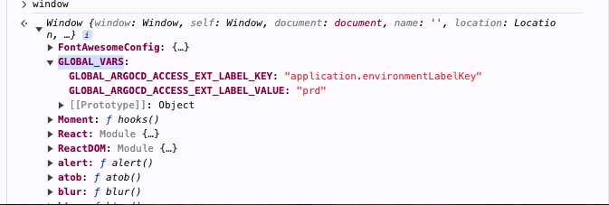

# Argo CD Extension Installer

This repo provides a docker image that can be used as an init
container to install Argo CD extensions.

# How to use this image

This image should be added in the Argo CD API server as an init
container. Once the API server starts the init container will download
and install the configured UI extension. All configuration is provided
as environment variables as part of the init container. Find below the
list of all environment variables that can be configured:

| Env Var                    | Required? | Default | Description                                                                                                                                                                                                              |
|----------------------------|----------|---------|--------------------------------------------------------------------------------------------------------------------------------------------------------------------------------------------------------------------------|
| EXTENSION_NAME             | Yes      | ""      | Extension Name                                                                                                                                                                                                           |
| EXTENSION_ENABLED          | No       | true    | If set to false will skip the installation. Noop                                                                                                                                                                         |
| EXTENSION_URL              | Yes      | ""      | Must be set to a valid URL where the UI extension can be downloaded from. <br>Argo CD API server needs to have network access to this URL.                                                                               |
| EXTENSION_VERSION          | Yes      | ""      | The version of the extension to be installed.                                                                                                                                                                            |
| EXTENSION_CHECKSUM_URL     | No       | ""      | Can be set to the file containing the checksum to validate the downloaded<br>extension. Will skip the checksum validation if not provided.<br>Argo CD API server needs to have network access to this URL.               |
| MAX_DOWNLOAD_SEC           | No       | 30      | Total time in seconds allowed to download the extension.                                                                                                                                                                 |
| EXTENSION_EXT_JS_VARS      | No       | ""      | Export the variables to `extension-$EXTENSION_EXT_JS_VARS` in js file within the extension folder. These variables will be exported as env variables with key `ARGOCD_EXT_VARS`. <br/>The format should be `{key1=value1, key2=value2}`. |
    


```yaml
apiVersion: v1
kind: ConfigMap
metadata:
  name: argocd-extension-cm
data:
 extension.url: 'http://example.com/extension.tar.gz'
 extension.version: 'v0.3.1'
 # optional fields
 extension.enabled: 'true'
 extension.checksum_url: 'http://example.com/extension_checksums.txt'
 extension.max_download_sec: '30'
 extension.ext_js_vars : |
     {
       "key1": "value1",
       "key2": "value2"
     }

```

```yaml
apiVersion: apps/v1
kind: Deployment
metadata:
  name: argocd-server
spec:
  template:
    spec:
      initContainers:
        - name: extension
          # The image digest must be appended after the tag.
          # New tag digest can be obtained in quay by clicking in the
          # "fetch tag" icon and select "Docker Pull (by digest)":
          # https://quay.io/repository/argoprojlabs/argocd-extension-installer?tab=tags
          image: docker.intuit.com/quay-rmt/argoprojlabs/argocd-extension-installer:v0.0.1@sha256:f50fa11a4592f3fcdd5a137dab8ed32067bb779a77a393f179e8a5d96abe1a80
          env:
          - name: EXTENSION_NAME
            valueFrom:
              configMapKeyRef:
                key: extension.name
                name: argocd-extension-cm
          - name: EXTENSION_URL
            valueFrom:
             configMapKeyRef:
              key: extension.url
              name: argocd-extension-cm
          - name: EXTENSION_VERSION
            valueFrom:
             configMapKeyRef:
              key: extension.version
              name: argocd-extension-cm
            ## Optional fields
          - name: EXTENSION_EXT_JS_VARS
            valueFrom:
             configMapKeyRef:
              key: extension.js_vars
              name: argocd-extension-cm
          volumeMounts:
            - name: extensions
              mountPath: /tmp/extensions/
          securityContext:
            runAsUser: 1000
            allowPrivilegeEscalation: false
      containers:
        - name: argocd-server
          volumeMounts:
            - name: extensions
              mountPath: /tmp/extensions/
```

### Exporting env as js extensions

Add the below config in the `argocd-extension-cm`:
```yaml
#name should match with the extension name e.g 'Metrics', 'Rollout', 'EphemeralAccess'
extension.name: 'example'
extension.ext_js_vars : |
     {
       "key1": "value1",
       "key2": "value2"
     }
```
Provide the config in argocd-server deployment as below:
```yaml
 ## Optional fields
  - name: EXTENSION_EXT_JS_VARS
    valueFrom:
     configMapKeyRef:
      key: extension.js_vars
      name: argocd-extension-cm
```
output:
```js
((window) => {
    const vars = {
        "key1": "value1",  "key2": "value2"
    };
    window.ARGOCD_EXT_VARS = vars;
})(window);
```
Exported envirnoment variables available in the widget:
